# pydrake-manipulator-docs

This document serves as a quick introduction to Kuka IIWA Robot and controlling it using Drake Python API. The examples are entirely in python and is easy to port to any other robot manipulator. Make sure you read the official Kuka documentation and is familiar with the functioning before operating the robot.

## **Contents**
- [Introduction](#introduction)
- [Kuka System Architecture](#kuka-system-architecture)
- [Programming the Robot](#programming-the-robot)
    - [Kuka Sunrise WorkBench](#kuka-sunrise-workbench)
    - [FRI](#fri)
- [Controlling IIWA from ROS](#controlling-iiwa-from-ros) 
- [Drake Concepts](#drake-concepts)
- [Drake drivers](#)
    - [Java App for Sunrise](#)
    - [kuka_driver LCM](#)
-  [LCM](#lcm)
    - [LCM Introduction](#)
    - [IIWA-LCM Interface](#)
 - [Drake Intro](#)
- [Robot hardware Interface/Drake-LCM Interface](#)
    - [Loading a custom robot model](#)
    - [Reading from hardware](#)
    - [writing to hardware](#)
- [Joint Control](#)
- [Visualizing the robot state in Drake visualizers](#)
- [Adding an end effector to the model](#)
- [Forward Kinematics](#)
- [Inverse Kinematics](#)
- [Estimating Cartesian Velocities](#)
- [Cartesian velocity control](#)
- [Estimating Cartesian forces](#)
- [Hybrid Force-Position control](#)
- [Motion Planning -  Generating Trajectories](#)

## **Introduction**


Kuka LBR IIWA is a 7 DOF collaborative robot manipulator which has got excellent torque control capabilities in addition to the common position control features. This enables capabilities like impedence control which is much benefitial when the  robot has to interact with noisy environment models, where pure position control can break things (or even the robot). The robot has joint torque sensors on all the joints. ( It should be noted that the torque estimation is not as accurate as an external Force-Torque sensor. It is observed that the error depends on robot pose and has an accuracy of approximately 5N)

## **Kuka System Architecture** 

A typical architecture of the manipulation station will be as follows:

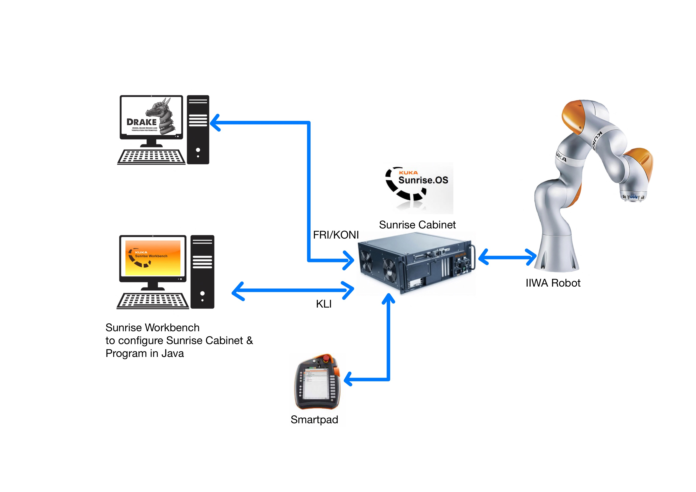

IIWA manipulator is controlled by Kuka Sunrise Cabinet controller. It has an industrial PC running  Kuka's version of Windows CE called Sunrise OS and a realtime OS. The sunrise OS handles the user program, GUI etc and is accessible to the user. The realtime part is hidden from the user and controls the low level hardware interfaces. 

The Sunrise Cabinet have multiple Ethernet interfaces. Kuka Line Interface (KLI) (Port X66) is the only one enabled by default and is used to connect the Controller to an external PC. Kuka provides Sunrise Workbench IDE with which the IIWA could be programmed in Java. The IDE also helps installing software packages and configuring settings such as network and safety configurations, input-output etc.

The other interface called Fast Robot Interface (FRI) enables access to the robot controller from an external computer in real time. It operates over the Kuka Optional Network Interface (KONI) and has to be enabled by installing the FRI package. Drake uses this interface to interface with the IIWA hardware.

Additional interfaces like EtherCAT, PROFINET are also available, which can be enabled by installing the corresponding software package from Kuka. 

Kuka Smartpad, the handheld controller allows to start and stop the programs loaded into the SunriseCabinet. In fact,  it shows the remote desktop view of the Sunrise OS running inside the Cabinet. Conecting an external monitor to the DVI port on the back side of the Sunrise Cabinet also shows the same Smartpad GUI. In addition, it is also possible to access the Smartpad GUI using Remote Desktop tools over the KLI ethernet port.

The following are the default IP address of the Ethernet Ports:

        KLI :          172.31.1.147
        KONI FRI :     192.170.10.2

        Remote Desktop: 172.31.1.147
        Username:       KukaUser
        Password:       68kuka1secpw59


The following documents give a detailed overview of the Kuka IIWA Robot systems. It  is recommended to get familiarized with the IIWA system from the following documents before operating the robot. 
 - [KUKA Sunrise.OS 1.16, Operating Instructions for End Users](https://indianinstituteofscience-my.sharepoint.com/:b:/g/personal/achuwilson_iisc_ac_in/EV4iYsOWqzJDo67tXQCS5RkBYui1geiQtkUp61vTxEKwrA) 
 - [KUKA Sunrise Cabinet Operating Instructions](https://indianinstituteofscience-my.sharepoint.com/:b:/g/personal/achuwilson_iisc_ac_in/Edw4l1pf6npHoR7z2O2gx-IB9v7VA7hakrdIowxQbYPMbA?e=wyLi8R)
 - [System Software KUKA Sunrise.OS 1.16, KUKA Sunrise.Workbench 1.16, Operating and Programming Instructions for System Integrators](https://indianinstituteofscience-my.sharepoint.com/:b:/g/personal/achuwilson_iisc_ac_in/ETb2S5FZac5DiL733qOmhicB3BOZzJFAMyjdIQaC3mI6rA?e=9Ne5Gq). This document has Java API documentation

NOTE: the linked documents could not be shared publically as it would violate Kuka's Copyright notice and require IISc login. You could also create a free account on [Kuka Xpert](https://xpert.kuka.com) to download these


## **Programming the Robot**

Kuka basically provides the following two methods to program the robot
 - Kuka Sunrise Workbench
 - FRI

### **Kuka Sunrise Workbench**


 The default programming option provided by Kuka is through its Java APIs using Sunrise Workbench, which is infact a customized Eclipse IDE. It is not available for download on the Kuka website, as it has to match the version of the Sunrise OS running on the controller, So request for your copy of Sunrise Workbench to your Kuka robot supplier.
 
 The Java APIs may differ slightly depending upon the version of the Sunrise OS and Workbench that is being used. It is available in the  [Kuka Senrise Workbench Operating and Programming Instructions](https://indianinstituteofscience-my.sharepoint.com/:b:/g/personal/achuwilson_iisc_ac_in/ETb2S5FZac5DiL733qOmhicB3BOZzJFAMyjdIQaC3mI6rA?e=9Ne5Gq) 

 After developing an application in the Sunrise Workbench, the user has to synchromize it with the Sunrise OS in the controller. This just copies the project files to the controller over the KLI port. 

 NOTE: While creating a new project and synchronizing it with the Controller, after changing any safety related settings, the SmartPad would show a "safety configuration not activated" error. The default password to activate the safety configuration is ```ARGUS```


After loading them, applications can be selected and executed using the 
 Smartpad interface. The Key on the Smartpad helps switch between ```AUT``` - automatic and ```T1``` - reduced velocity mode. 
 
### **FRI**  
  
  FRI stands for "Fast Robot Interface", which is an addon provided by Kuka, enables real time control of the robot system. This requires control signals be generated in an external computer and sent over the KONI Ethernet port. The FRI is not enabled out of the box and has to be installed and enabled through the Sunrise workbench. The default IP address of the FRI interface is ```192.170.10.2```

  Kuka provides FRI-Client libararies in C++ and Java, which can be found inside the examples directory after the installation of FRI library in Sunrise WorkBench. The C++ libraries can be found in the file named ```FRI-Client-SDK_Cpp.zip```. It can be used to build applications that communicates with Kuka controller over FRI.

  Drake uses the FRI interface to control the IIWA from an external computer.  

## **Controlling IIWA from ROS**

The [```iiwa_stack```](https://github.com/IFL-CAMP/iiwa_stack) package can be used to interface IIWA fron ROS. It uses the Smart Servoing functionality over the KLI network interface. 

The ROSJava nodes running on the robot controller as a Sunrise RobotApplication sends data and receives commands from a ROS master running on the external PC. The [wiki](https://github.com/IFL-CAMP/iiwa_stack/wiki) provides detailed instructions on controlling from ROS.

## **Controlling IIWA from Drake**
### **Drake IIWA Java Application**
 The Java application runs on the on the Sunrise Controller and opens an FRI connection to which the ```kuka_driver``` running on an external computer connects to.


 The detailed documentation and code is available in [```drake-iiwa-driver```](https://github.com/RobotLocomotion/drake-iiwa-driver) 
 There are two applications

  - DrakeFRIPositionDriver 
  - DrakeFRITorqueDriver

  The DrakeFRIPositionDriver, as the name  implies allows controlling the robot in position control mode, taking in joint position commands. 

  The DrakeFRITorqueDriver allows for the control of the robot in impedance control mode and takes in joint position as well as joint feedforward torque comands. We would be using this mode more often.

  Both the drivers output robot status like joint positions, velocities, torques etc

  
### **kuka_driver** 
The ```kuka_driver``` runs on the external computer, connects to the Java application running on the robot and provides an LCM interface to read/write data.

It has to be compiled as in this [documentation](https://github.com/RobotLocomotion/drake-iiwa-driver/blob/master/README.md) and requires FRI client SDK for compilation.

After compilation, the ```kuka_driver``` should be run first, so as to communicate with IIWA
### **LCM**

[LCM](https://lcm-proj.github.io/) stands for Lightweight Communications and Marshalling. It is a set of libraries that can provide publish/subscribe message passing capabilities.

#### **IIWA-LCM Interface**
```kuka_driver``` provides read/write interface to the IIWA thriugh LCM messages. It generates three LCM messsage channels
 - ```IIWA_STATUS``` of the type ```lcmt_iiwa_status```, defined in [```lcmt_iiwa_status.lcm```](https://github.com/RobotLocomotion/drake/blob/master/lcmtypes/lcmt_iiwa_status.lcm)
 - ```IIWA_COMMAND``` of the type ```lcmt_iiwa_command```, defined in [```lcmt_iiwa_command.lcm```](https://github.com/RobotLocomotion/drake/blob/master/lcmtypes/lcmt_iiwa_command.lcm)
 - ```IIWA_STATUS_TELEMETRY``` of the type ```lcmt_iiwa_status_telemetry```, defined in [```lcmt_iiwa_status_telemetry.lcm```](https://github.com/RobotLocomotion/drake/blob/master/lcmtypes/lcmt_iiwa_status_telemetry.lcm)

By default, ```kuka_driver``` publishes/ subscribes these messages at 200Hz

```IIWA_STATUS``` provides the robot joint status which includes joint position, velocities and torques. An example which subscribes to the ```IIWA_STATUS``` and prints the output is available in [```lcm_examples/iiwa-lcm-listener.py```](https://github.com/achuwilson/pydrake_iiwa/blob/main/lcm_examples/iiwa-lcm-listener.py)

```IIWA_COMMAND``` is used to command joint positions with an optional feed forward joint torque. An example which subscribes to ```IIWA_STATUS``` to estimate the current robot configuration and move joint 7 incrementally is available in [```lcm_examples/iiwa-lcm-publisher.py```](https://github.com/achuwilson/pydrake_iiwa/blob/main/lcm_examples/iiwa-lcm-publisher.py)

```IIWA_STATUS_TELEMETRY``` provides timing information, which can be used to estimate the latency in the FRI communication between the external computer and the robot controller.

#### **Plotting LCM Messages**
Drake includes ```drake-lcm-spy``` in ```/opt/drake/bin``` to plot and visualize LCM messages.
## **Drake**
[Drake](https://drake.mit.edu/) is a toolbox which can model dynamic systems, solve mathematical problems and has built in multibody kinematics and dynamics.


### **Systems**
The basic building block of Drake is a ```System```, which has input and output ports as well as an optional state. Multiple systems can be interconnected either as a ```Diagram``` or ```LeafSystem```. LeafSystems are the minimum building block and is often used for basic components like sensors, actuators, controllers, planners etc, which has a specific functionality. Drake come with many built-in systems which can be found in the [official documentation](https://drake.mit.edu/doxygen_cxx/group__systems.html)

### **Diagrams**

Diagrams consists of multiple LeafSystems or even other Diagrams inside and are used to represent a set of interconnected systems that function as a whole.

[```example_drake_simplediagram.py```](https://github.com/achuwilson/pydrake_iiwa/blob/main/example_drake_simplediagram.py) creates a simple diagram which looks as follows:


The built-in ```SystemSlider``` is used to create a GUI with 3 sliders, whose output is fed into a ```PrintSystem``` which evaluates and prints the input values to terminal at a specific update rate.

### **Context**

All ```Diagram``` and ```System``` has a ```Context``` which embodies the state and parameters of the system. In addition to the ```Context``` of the main diagram, each subsystems and sub diagrams have their own unique context with with we can interact with the internals of the systems. Given the ```context```, all methods called on a Diagram or System is deterministic and repeatable.  The ```Simulator``` needs the ```Diagram``` and its ```Context```for running the computations.

### **MultibodyPlant**

```MultibodyPlant``` is one of the most important built-in systems that Drake provides. It is to represent multiple rigid bodies connected in tree, a common practice with serial robot manipulators. It internally uses rigid body tree algorithms to compute the kinematics. ```MultibodyPlant``` also has both inputs and outputs which could be connected to other systems such as controllers or visualizers.

### **Tutorials**
Drake provides a set of [tutorials](https://github.com/RobotLocomotion/drake/tree/master/tutorials)


[```dynamical_systems.ipynb```](https://github.com/RobotLocomotion/drake/blob/master/tutorials/dynamical_systems.ipynb) gives an introduction to modelling systems in Drake

[```mathematical_program.ipynb```](https://github.com/RobotLocomotion/drake/blob/master/tutorials/mathematical_program.ipynb) introduces numerical programming capabilities of Drake


## **Manipulation Station**
The manipulation station consists of the IIWA robot, the Drake systems required to communicate and parse the data with the IIWA as well as other optional hardware such as cameras, grippers etc
  
The ```IiwaManipulationStation```, defined in [```iiwa_manipulation_station.py```](https://github.com/achuwilson/pydrake_iiwa/blob/main/iiwa_manipulation_station.py) is a ```Diagram``` which has to be included and initialized in the diagram created by the user, so as to communicate with the IIWA. It consists of the following systems:
        
        - LcmInterfaceSystem
        - LcmSubscriberSystem
        - LcmPublisherSystem
        - IiwaCommandSender
        - IiwaStatusReceiver
        - MultibodyPlant


The diagram of the manipulation system looks as follows:

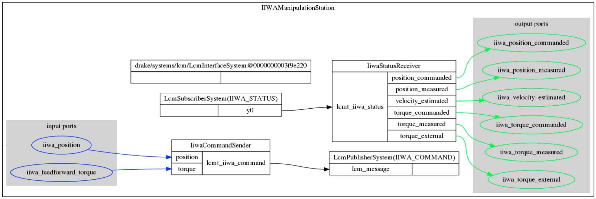


The ```LcmInterfaceSystem``` has no inputs nor outputs nor state nor parameters; it declares only an update event that pumps LCM messages into their subscribers if the LCM stack has message(s) waiting. The subscribers will then update their outputs using their own declared events

The ```LcmSubscriberSystem``` subscribes to the LCM data stream and outputs the recived data through a single output port.

The ```LCMPublisherSystem``` has a single input port and outputs the received data to the LCM data stream at a specified update rate.


The ```IiwaStatusReceiver```, defined in [```iiwa_status_receiver.py```](https://github.com/achuwilson/pydrake_iiwa/blob/main/iiwa_status_receiver.py) parses the ```IIWA_STATUS``` LCM  message into the following vector valued outputs:

        - position_commanded
        - position_measured
        - velocity_estimated
        - torque_commanded
        - torque_measured
        - torque_external
An example on using ```IiwaStatusReceiver``` is available in [```example_iiwa_status_receiver.py```](https://github.com/achuwilson/pydrake_iiwa/blob/main/example_iiwa_status_receiver.py)


The ```IiwaCommandSender```,  defined in  [```iiwa_command_sender.py```](https://github.com/achuwilson/pydrake_iiwa/blob/main/iiwa_command_sender.py) encodes the input into ```IIWA_COMMAND``` LCM message which is pubblished by the ```LcmSubscriberSystem```. It has the following two vector valued inputs accapting vectors of size 7.

        - position
        - torque

 An example usage of ```IiwaCommandSender``` is available in [```example_iiwa_command_sender.py```](https://github.com/achuwilson/pydrake_iiwa/blob/main/example_iiwa_command_sender.py). Be EXTREMELY CAUTIOUS  before running this example, as it would instantaneously command 0 positions to joints. Don't run this example unless all joints are near to zero position. 
 
 The ```MultibodyPlant``` models the external plant that has to be controlled and helps in the computation of its kinematics and dynamics.


The input and output ports of the individual systems inside inside a diagram has to be exported to outside so that other drake systems can interface with the inner systems. The ```ExportOutput``` and ```ExportInput``` methods of ```DiagramBuilder``` are used for this.

# **Examples**
To run the examples, follow these steps
- STEP1: Make sure that the Kuka is in ```AUT ``` mode in SmartPad
- STEP2: Select and run ```DrakeFRITorqueDriver``` Application from the Smartpad 
- STEP3: run ```kuka_driver```  in the PC. This will cause the brakes on IIWA to release
- STEP4: (optional) Start ```drake-visualizer``` or ```meshcat-server``` for examples requiring visualization
- STEP4: run the example
## **Joint Control**
[```example_joint_slider.py```](https://github.com/achuwilson/pydrake_iiwa/blob/main/example_joint_slider.py)

In this simple example, we make use of the drake ```JointSliders``` system to control the joint values of the robot. 
The system diagram of the example is as follows:

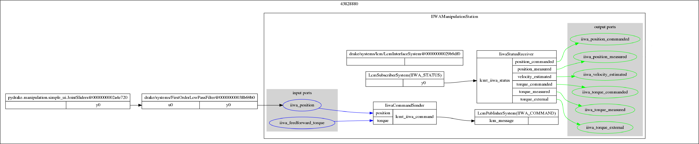

The output port of the ```JointSliders``` system is connected through a ```FirstOrderLowPassFilter``` to the ```iiwa_position``` port of the ```IiwaHardwareInterface``` manipulation station. The ```FirstOrderLowPassFilter``` helps to smoothen the motion by filtering out high frequency changes in position which may cause jerk.


## **Visualizing the robot state in Drake visualizers**
[```example_iiwa_visualize.py```](https://github.com/achuwilson/pydrake_iiwa/blob/main/example_iiwa_visualize.py)

Drake has multiple visualizers and uses the SceneGraph system to output the visualizations. By default, Drake comes with a VTK based visualizer which is located in ```/opt/drake/bin/drake-visualizer```. We have to launch the visualizer before running the simulation.

Drake also has a Meshcat based visualizer which can display the output in a browser window. Run ```meshcat-server``` present in the same directory. Meshcat visualizer is greatly helpful when running Drake as IPython notebooks in Google Colab

The system diagram of the example is as follows:

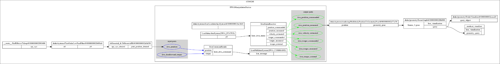

In the [```example_iiwa_visualize.py```](https://github.com/achuwilson/pydrake_iiwa/blob/main/example_iiwa_visualize.py) example,  the ```MultibodyPositionToGeometryPose``` system takes in the joint positions of the robot and outputs the pose output required by the ```SceneGraph``` system. The ```DrakeVisualizer``` and ```meshcat_visualizer``` queries the scenegraph system and updates the rendering.

The DrakeVisualizer looks as follows:

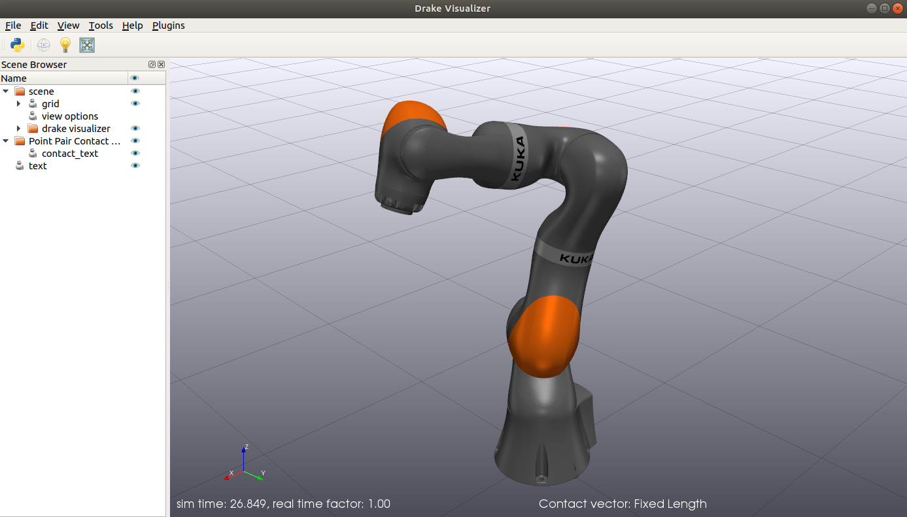

## **Adding an end effector**
[```example_iiwa_endeffector.py```](https://github.com/achuwilson/pydrake_iiwa/blob/main/example_iiwa_endeffector.py)

This example demonstrates how to add a custom end-effector/gripper to the ```IiwaManipulationStation```. End effector models, either in URDF or SDF format could be imported and added to the ```MultibodyPlant``` before finalizing it. It also needs to be welded to the last link of IIWA.

Following image shows IIWA attached with the small blue finger defined in [```models/onefinger.urdf```](https://github.com/achuwilson/pydrake_iiwa/blob/main/models/onefinger.urdf):

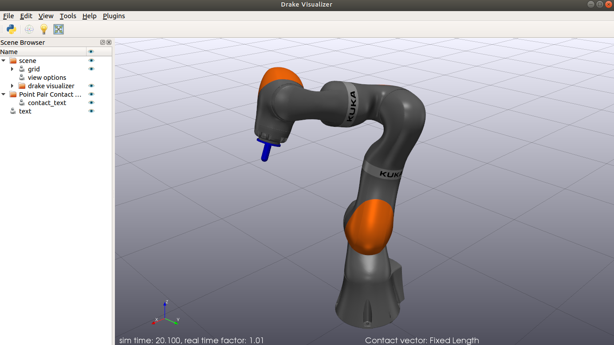

Once the end-effector is added to the MultibodyPlant, we can refer to it by the name defined in the URDF file. 

## **Forward Kinematics**

[```example_FK.py```](https://github.com/achuwilson/pydrake_iiwa/blob/main/example_FK.py) 

Forward Kinematics calculates the position of end effector/gripper in the world given the joint position values.

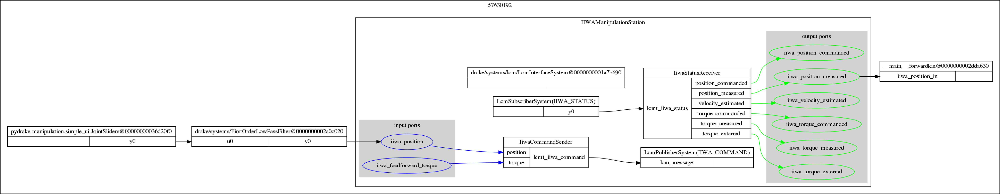

In this example, the low pass filtered values from the slider is used to set the joint positions of the IIWA hardware. The ```iiwa_position_measured``` output port of the manipulation station is connected to the ```FKSystem```, where the joint values of the multibodyplant are updated. The ```EvalBodyPoseInWorld``` function can be used to evaluate the position of the body in the world. 


## **Inverse Kinematics**
[```example_IK.py```](https://github.com/achuwilson/pydrake_iiwa/blob/main/example_IK.py) 

Inverse Kinematics solves for the joint positions required to reach a particular end-effector pose.

Drake has a numeric [InverseKinematics](https://drake.mit.edu/doxygen_cxx/classdrake_1_1multibody_1_1_inverse_kinematics.html) solver which  formulates IK as a nonlinear optimization problem. We can specify non linear inequality constraints like minimum distance between bodies, position/orientation constraints, target gaze constraints etc.
Refer to [MIT 6.881 Lecture 15, Motion Planning, Part 1](https://www.youtube.com/watch?v=RjKkA_6-0C4) for more insights on Inverse kinematics and declaring constraints. Corresponding [IPython Notebook](https://github.com/RussTedrake/manipulation/blob/master/trajectories.ipynb)

Drake also has a [Differential Inverse Kinematics solver](https://drake.mit.edu/doxygen_cxx/namespacedrake_1_1manipulation_1_1planner.html), which calculates joint velocities using Jacobians and integrates it to calculate the joint position. The [```example_IK.py```](https://github.com/achuwilson/pydrake_iiwa/blob/main/example_IK.py) uses the differential IK method implemented in [```differential_ik.py```](https://github.com/RobotLocomotion/drake/blob/master/examples/manipulation_station/differential_ik.py)

The system diagram of the [```example_IK.py```](https://github.com/achuwilson/pydrake_iiwa/blob/main/example_IK.py) is as follows:
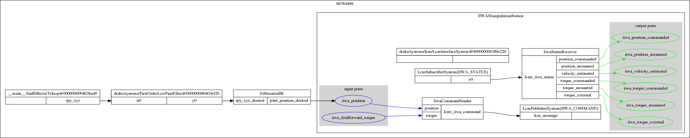


##  **Estimating Cartesian Velocities**
[```example_velocity_estimate.py```](https://github.com/achuwilson/pydrake_iiwa/blob/main/example_velocity_estimate.py)

End effector velocities can be estimated by multiplying the robot Jacobian with joint velocities. Drake ```MultibodyPlant``` has the ```CalcJacobianSpatialVelocity``` method, which could be used to calculate the Spatial Jacobian. 

The system diagram of the example is as follows:
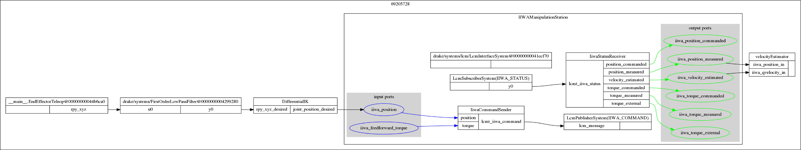

In [```example_velocity_estimate.py```](https://github.com/achuwilson/pydrake_iiwa/blob/main/example_velocity_estimate.py), The output of ```EndEffectorTeleop``` is used to control the cartesian end effector position through the ```DifferentialIK``` system. The ```iiwa_velocity_estimated``` and ```iiwa_position_measured``` outputs of the manipulation station are used by the  ```velocityEstimator``` system to calculate the Jacobian and corresponding  end effector velocities.

## **Cartesian velocity control**
[```example_velocity_control.py```](https://github.com/achuwilson/pydrake_iiwa/blob/main/example_velocity_control.py)

WARNING: Pay close attention when running this example on the real robot. The end effector keeps on moving at the commanded velocity, until the slider is moved back to zero.

Joint velocities required to move the end effector at a desired velocity in cartesian space are computed using an inverse Jacobian controller. 

The system diagram is as follows:
 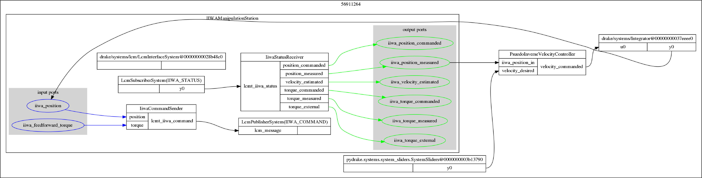

The desired end effector velocity from the slider and the current joint position is fed as inputs to the  ```PseudoInverseVelocityController```. It calculates the required joint velocities, which are integrated and fed as ```iiwa_position``` input.

## **Estimating Cartesian forces**
[```example_force_estimate.py```](https://github.com/achuwilson/pydrake_iiwa/blob/main/example_force_estimate.py)

IIWA has joint torque sensors at all the 7 joints. This example uses jacobian transpose to estimate the forces and in cartesian space at the end effector from the measured joint torques. 

The system diagram of the example is as follows:
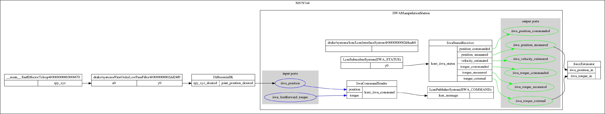

It looks similar to the velocity estimation system, except that in this case, there is a ```forceEstimator``` system that takes in ```iiwa_position_measured``` and ```iiwa_torque_external```

## **Hybrid Force-Position control**
[```example_force_feedforward.py```](https://github.com/achuwilson/pydrake_iiwa/blob/main/example_force_feedforward.py)

In Hybrid force-position demo, the end effector is able to move to/maintain a position as well excert force in arbitrary directions.

We make use of the ```iiwa_feedforward_torque``` input to provide additional joint torques. These torques are calculated using Jacobian transpose pseudo-inverse in the ```FeedForwardForceController``` system. while running the demo, two windows will pop up, one for controlling the cartesian position and the other for the cartesian wrench.

The system diagram of the example is as follows:
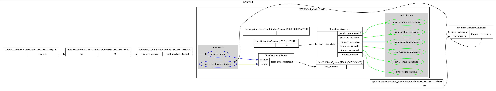

## **Motion Planning and Collision Avoidance**
TODO
## **Gravity Compensation**
TODO
## **Haptic Force Feedback**
TODO