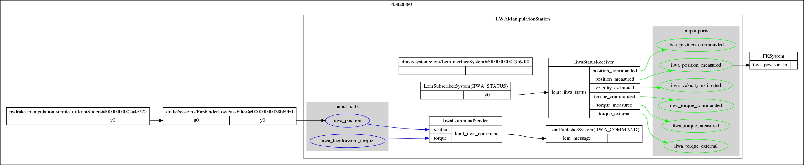

# pydrake-manipulator-docs

This document serves as a quick introduction to Kuka IIWA Robot and controlling it (or any other manipulator) using Drake Python API

## **Contents**
- [Introduction](#introduction)
- [Kuka System Architecture](#kuka-system-architecture)
- [Programming the Robot](#programming-the-robot)
    - [Kuka Sunrise WorkBench](#kuka-sunrise-workbench)
    - [FRI](#fri)
- [Controlling IIWA from ROS](#controlling-iiwa-from-ros) 
- [Drake Concepts](#drake-concepts)
- [Drake drivers](#)
    - [Java App for Sunrise](#)
    - [kuka_driver LCM](#)
-  [LCM](#lcm)
    - [LCM Introduction](#)
    - [IIWA-LCM Interface](#)
 - [Drake Intro](#)
- [Robot hardware Interface/Drake-LCM Interface](#)
    - [Loading a custom robot model](#)
    - [Reading from hardware](#)
    - [writing to hardware](#)
- [Joint Control](#)
- [Visualizing the robot state in Drake visualizers](#)
- [Adding an end effector to the model](#)
- [Forward Kinematics](#)
- [Inverse Kinematics](#)
- [Estimating Cartesian Velocities](#)
- [Cartesian velocity control](#)
- [Estimating Cartesian forces](#)
- [Hybrid Force-Position control](#)
- [Motion Planning -  Generating Trajectories](#)

## **Introduction**


Kuka LBR IIWA is a collaborative robot manipulator which has got excellent torque control capabilities in addition to the default position control features. This enables capabilities like impedence control which is much benefitial when the  robot has to interact with noisy environment models, where pure position control can break things (or even the robot)

## **Kuka System Architecture** 
The following documents give a detailed overview of the Kuka IIWA Robot systems.
 - [KUKA Sunrise.OS 1.16Operating Instructions for End Users](https://indianinstituteofscience-my.sharepoint.com/:b:/g/personal/achuwilson_iisc_ac_in/EV4iYsOWqzJDo67tXQCS5RkBYui1geiQtkUp61vTxEKwrA) 
 - [KUKA Sunrise CabinetOperating Instructions](https://indianinstituteofscience-my.sharepoint.com/:b:/g/personal/achuwilson_iisc_ac_in/Edw4l1pf6npHoR7z2O2gx-IB9v7VA7hakrdIowxQbYPMbA?e=wyLi8R)
 - [System SoftwareKUKA Sunrise.OS 1.16KUKA Sunrise.Workbench 1.16Operating and Programming Instructions for System Integrators](https://indianinstituteofscience-my.sharepoint.com/:b:/g/personal/achuwilson_iisc_ac_in/ETb2S5FZac5DiL733qOmhicB3BOZzJFAMyjdIQaC3mI6rA?e=9Ne5Gq)

NOTE: the linked documents are not shared publically and require IISc login

The Kuka sunrise cabinet controller has an industrial PC running  Kuka's version of Windows CE called Sunrise OS and a realtime OS. The sunrise OS handles the user program, GUI etc and is accessible to the user. The realtime part is hidden from the user and controls the low level motor drivers and other hardware interfaces. 

Kuka Smartpad, the handheld controller is just a system which shows the remote desktop view of the above mentioned Sunrise OS. Conecting an external monitor to the DVI port on the back side of the controller box shows the same Smartpad GUI. It is also possible to access the Smartpad GUI using Remote Desktop tools. The login credentials for the remote desktop are:

IP address: ```172.31.1.147``` \
Username:  ```KukaUser```\
password: ```68kuka1secpw59```


The user often connects to the robot over an Ethernet interface to pogram/control the robot. Additional interfaces like EtherCat, profinet are also available. 


## **Programming the Robot**

Kuka basically provides the following two methods to program the robot
 - Kuka Sunrise Workbench
 - FRI

### **Kuka Sunrise Workbench**
 The default programming option provided by Kuka is through its Java APIs using an IDE called Sunrise Workbench which is infact a customized Eclipse IDE. It is not available for download on any Kuka websites, as it has to match the version of the Sunrise OS running on the controller, So request for your copy of Sunrise Workbench to your Kuka robot supplier
 
 The Java APIs may differ slightly epending upon the version of the Sunrise OS and Workbench that is being used. It is available in the  (TODO -find name) document. A sample is available here. It also provides information on configuing the robot

 After developing an application in the Sunrise Workbench, the user has to synchromize it with the Sunrise OS in the controller. This just copies the project files to the controller over an ethernet port (Port X66 - Kuka Line Interface - KLI ). The default IP addess of the KLI port is ```172.31.1.147```  and a static IP must be set for the customer PC. 
 
 While creating a new project and synchronizing it with the Controller, if you changed any safety related settings, then the SmartPad would show a safety configuration not activated error. The default password to activate the safety configuration is ```ARGUS```


After loading the  applications, the desired one has to be selected and executed using the 
 Smartpad interface. 
 
### **FRI**  
  
  FRI stands for "Fast Research Interface", which is an addon provided by Kuka, which enables real time control of the robot system at the lowest level possible. This requires control signals be generated in an external computer and sent over a specific Ethernet port called KONI -  Kuka Optional Network Interface. The FRI is not enabled out of the box and has to be installed and enabled through the Sunrise workbench. The default IP address of the FRI interface is ```192.170.10.2```

  Kuka provides FRI-Client libararies in C++ and Java, which can be found inside the examples directory after the installation of FRI library in Sunrise WorkBench. The C++ libraries can be found in the file named ```FRI-Client-SDK_Cpp.zip```. It can be used to build applications talks with Kuka controller over FRI.

  Drake uses the FRI interface to control the IIWA from an external computer.  

## **Controlling IIWA from ROS**

The [```iiwa_stack```](https://github.com/IFL-CAMP/iiwa_stack) package can be used to interface IIWA fron ROS. It uses the Smart Servoing functionality over the KLI network interface. 

The ROSJava nodes running on the robot as a Sunrise RobotApplication sends data and receives commands from a ROS master running on the external PC. The [wiki](https://github.com/IFL-CAMP/iiwa_stack/wiki) provides detailed instructions on getting ROS workinggit@github.com:achuwilson/pydrake-manipulator-docs.giter```
### **Drake IIWA Java Application**
 The Java application has to be compiled with the Kuka Sunrise Workbench and uploaded to the robot. The application opens an FRI connection to which the ```kuka_driver``` running on an external computer connects to.

 There are two Java applications
  - DrakeFRIPositionDriver 
  - DrakeFRITorqueDriver.

  The DrakeFRIPositionDriver as the name  implies allows controlling the robot in position control mode, taking in joint position commands. 

  The DrakeFRITorqueDriver allows for the control of the robot in impedance control mode and takes in joint position as well as joint feedforward torque comands

  Both the drivers output robot status like joint positions, velocities, torques etc

  
### **kuka_driver** 
The ```kuka_driver``` runs on the external computer, connects to the Java application running on the robot and provides an LCM interface to read/write data.

It has to be compiled as in this [documentation](https://github.com/RobotLocomotion/drake-iiwa-driver/blob/master/README.md) and requires FRI client SDK for compilation.

After compilation, the ```kuka_driver``` should be run in background 
## **LCM**

[LCM](https://lcm-proj.github.io/) stands for Lightweight Communications and Marshalling. It is a set of libraries that can provide publish/subscribe message passing capabilities for different applications.

### **IIWA-LCM Interface**
```kuka_driver``` provides read/write interface to the IIWA thriugh LCM messages. It generates three LCM messsage channels
 - ```IIWA_STATUS``` of the type ```lcmt_iiwa_status```, defined in [```lcmt_iiwa_status.lcm```](https://github.com/RobotLocomotion/drake/blob/master/lcmtypes/lcmt_iiwa_status.lcm)
 - ```IIWA_COMMAND``` of the type ```lcmt_iiwa_command```, defined in [```lcmt_iiwa_command.lcm```](https://github.com/RobotLocomotion/drake/blob/master/lcmtypes/lcmt_iiwa_command.lcm)
 - ```IIWA_STATUS_TELEMETRY``` of the type ```lcmt_iiwa_status_telemetry```, defined in [```lcmt_iiwa_status_telemetry.lcm```](https://github.com/RobotLocomotion/drake/blob/master/lcmtypes/lcmt_iiwa_status_telemetry.lcm)

By default, ```kuka_driver``` publishes/ subscribes these messages at 200Hz

```IIWA_STATUS``` provides the robot joint status which includes joint position, velocities and torques. An example which subscribes to the ```IIWA_STATUS``` and prints the output is available in [```lcm_examples/iiwa-lcm-listener.py```](https://github.com/achuwilson/pydrake_iiwa/blob/main/lcm_examples/iiwa-lcm-listener.py)

```IIWA_COMMAND``` is used to command joint positions with an optional feed forward joint torque. An example which subscribes to ```IIWA_STATUS``` to estimate the current robot configuration and move joint 7 incrementally is available in [```lcm_examples/iiwa-lcm-publisher.py```](https://github.com/achuwilson/pydrake_iiwa/blob/main/lcm_examples/iiwa-lcm-publisher.py)

```IIWA_STATUS_TELEMETRY``` provides timing information, which can be used to estimate the latency in the FRI communication between the external computer and the robot controller.

### **Custom Robot - LCM Interface**
In order to add a custom robot interface, we have to first create message type definitions specific to the robot configuration. This would involve the status message to get feedback from the robot and the  command message to issue control commands to the robot.

Once we have defined the custom message types, we have to create a driver, which will communicate with the robot hardware(such as through serial port/ethernet etc) and exchange the data with the LCM system as LCM messages
### **Plotting LCM Messages**

## **Drake**
### Some drake tutorials
- slider system print
- discrete time update system
- discrete callback system
## **LCM - Drake Interface**
Drake contains the following systems for communicating with LCM

- ```LcmInterfaceSystem```
- ```LcmSubscriberSystem```
- ```LcmPublisherSystem```


### **IIWA-Drake Interface** 

The IIWA - Drake hardware interface consists of two systems
- ```IiwaStatusReceiver``` defined in [```iiwa_status_receiver.py```](https://github.com/achuwilson/pydrake_iiwa/blob/main/iiwa_status_receiver.py)
- ```IiwaCommandSender```


### **Custom Robot - Drake Interface**

Similar to the IIWA example, systems that parse the LCM message and provide inputs/outputs to the Drake systems have to be implemented

## **Manipulation Station**
The manipulation station consists of the IIWA robot, the Drake systems required to communicate and parse the data with the IIWA as well as other optional hardware such as cameras, grippers etc
  
The ```IiwaManipulationStation```, defined in [```iiwa_manipulation_station.py```](https://github.com/achuwilson/pydrake_iiwa/blob/main/iiwa_manipulation_station.py) is a ```Diagram``` which has to be included and initialized in the diagram created by the user, so as to communicate with the IIWA. It consists of the following systems:
        
        - LcmInterfaceSystem
        - LcmSubscriberSystem
        - LcmPublisherSystem
        - IiwaCommandSender
        - IiwaStatusReceiver
        - MultibodyPlant


The diagram of the manipulation system looks as follows:


The ```LcmInterfaceSystem``` has no inputs nor outputs nor state nor parameters; it declares only an update event that pumps LCM messages into their subscribers if the LCM stack has message(s) waiting. The subscribers will then update their outputs using their own declared events

The ```LcmSubscriberSystem``` subscribes to the LCM data stream and outputs the recived data through a single output port

The ```LCMPublisherSystem``` has a single input port and outputs the received data to the LCM data stream at a specified update rate.


The ```IiwaStatusReceiver```, defined in [```iiwa_status_receiver.py```](https://github.com/achuwilson/pydrake_iiwa/blob/main/iiwa_status_receiver.py) parses the ```IIWA_STATUS``` LCM  message into the following vector valued outputs:

        - position_commanded
        - position_measured
        - velocity_estimated
        - torque_commanded
        - torque_measured
        - torque_external

The ```IiwaCommandSender```,  defined in  [```iiwa_command_sender.py```](https://github.com/achuwilson/pydrake_iiwa/blob/main/iiwa_command_sender.py) encodes the input into ```IIWA_COMMAND``` LCM message which is pubblished by the ```LcmSubscriberSystem```. It has the following two vector valued inputs accapting vectors of size 7.

        - position
        - torque

 The ```MultibodyPlant``` models the external plant that has to be controlled and helps in the computation of its kinematics and dynamics.


The input and output ports of the individual systems inside inside a diagram has to be exported to outside so that other drake systems can interface with the inner systems. The ```ExportOutput``` and ```ExportInput``` methods of ```DiagramBuilder``` are used for this.
### **IIWA Manipulation station**
### **Custom Manipulation station**
## **Joint Control**
[```example_joint_slider.py```](https://github.com/achuwilson/pydrake_iiwa/blob/main/example_joint_slider.py)

In the [```example_joint_slider.py```](https://github.com/achuwilson/pydrake_iiwa/blob/main/example_joint_slider.py) example, we make use of the drake ```JointSliders``` system to control the joint values of the robot. The output port of the ```JointSliders``` system is connected through a ```FirstOrderLowPassFilter``` to the ```iiwa_position``` port of the ```IiwaHardwareInterface``` manipulation station.


## **Visualizing the robot state in Drake visualizers**
[```example_iiwa_visualize.py```](https://github.com/achuwilson/pydrake_iiwa/blob/main/example_iiwa_visualize.py)

Drake has multiple visualizers and uses the SceneGraph method to output the visualizations. By default, Drake comes with a VTK based visualizer which is located in ```/opt/drake/bin/drake-visualizer```. We have to launch the visualizer before running the simulation.

Drake also has a Meshcat based visualizer which can display the output in a browser window. Run ```meshcat-server``` present in the same directory. Meshcat visualizer is greatly helpful when running Drake as IPython notebooks in Google Colab

The system diagram of the example is as follows:


In the [```example_iiwa_visualize.py```](https://github.com/achuwilson/pydrake_iiwa/blob/main/example_iiwa_visualize.py) example,  the ```MultibodyPositionToGeometryPose``` system takes in the joint positions of the robot and outputs the pose output required by the ```SceneGraph``` system. The ```DrakeVisualizer``` and ```meshcat_visualizer``` queries the scenegraph system and updates the rendering.

The DrakeVisualizer looks as follows:


## **Adding an end effector to the model**
[```example_iiwa_end_effector.py```](https://github.com/achuwilson/pydrake_iiwa/blob/main/example_iiwa_visualize.py)

The end effector model can be imported as a URDF/SDF file and be added to the multibody plant before finalizing and initializing it. 

In the example, we use a simple one finger defined in [```models/one_finger.urdf```](#) and adds it to out manipulation system. The [```example_iiwa_end_effector.py```](https://github.com/achuwilson/pydrake_iiwa/blob/main/example_iiwa_visualize.py) shows this functionality
## **Forward Kinematics**

[```example_FK.py```](https://github.com/achuwilson/pydrake_iiwa/blob/main/example_FK.py) 

Forward Kinematics calculates the position of end effector/gripper in the world given the joint position values.



In this example, the low pass filtered values from the slider is used to set the joint positions of the IIWA hardware. The ```iiwa_position_measured``` output port of the manipulation station is connected to the ```FKSystem```, where the joint values of the multibodyplant are updated. The ```EvalBodyPoseInWorld``` function can be used to evaluate the position of the body in the world. 


## **Inverse Kinematics**
[```example_IK.py```](https://github.com/achuwilson/pydrake_iiwa/blob/main/example_IK.py) 

Inverse Kinematics solves for the joint positions required to reach a particular end-effector pose.

Drake has a numeric [InverseKinematics](https://drake.mit.edu/doxygen_cxx/classdrake_1_1multibody_1_1_inverse_kinematics.html) solver which  formulates IK as a nonlinear optimization problem. We can specify non linear inequality constraints like minimum distance between bodies, position/orientation constraints, target gaze constraints etc.
Refer to [MIT 6.881 Lecture 15, Motion Planning, Part 1](https://www.youtube.com/watch?v=RjKkA_6-0C4) for more insights on Inverse kinematics and declaring constraints. Corresponding [IPython Notebook](https://github.com/RussTedrake/manipulation/blob/master/trajectories.ipynb)

Drake also has a [Differential Inverse Kinematics solver](https://drake.mit.edu/doxygen_cxx/namespacedrake_1_1manipulation_1_1planner.html), which calculates joint velocities using Jacobians and integrates it to calculate the joint position. The [```example_IK.py```](https://github.com/achuwilson/pydrake_iiwa/blob/main/example_IK.py) uses the differential IK method implemented in [```differential_ik.py```](https://github.com/RobotLocomotion/drake/blob/master/examples/manipulation_station/differential_ik.py)

The system diagram of the [```example_IK.py```](https://github.com/achuwilson/pydrake_iiwa/blob/main/example_IK.py) is as follows:


##  **Estimating Cartesian Velocities**
[```example_velocity_estimate.py```](https://github.com/achuwilson/pydrake_iiwa/blob/main/example_velocity_estimate.py)

End effector velocities can be estimated by multiplying the robot Jacobian with joint velocities. Drake ```MultibodyPlant``` has the ```CalcJacobianSpatialVelocity``` method, which could be used to calculate the Spatial Jacobian. 

The system diagram of the example is as follows:


In [```example_velocity_estimate.py```](https://github.com/achuwilson/pydrake_iiwa/blob/main/example_velocity_estimate.py), The output of ```EndEffectorTeleop``` is used to control the cartesian end effector position through the ```DifferentialIK``` system. The ```iiwa_velocity_estimated``` and ```iiwa_position_measured``` outputs of the manipulation station are used by the  ```velocityEstimator``` system to calculate the Jacobian and corresponding  end effector velocities.

## **Cartesian velocity control**
[```example_velocity_control.py```](https://github.com/achuwilson/pydrake_iiwa/blob/main/example_velocity_control.py)

WARNING: Pay close attention when running this example on the real robot. The end effector keeps on moving at the commanded velocity, until the slider is moved back to zero.

Joint velocities required to move the end effector at a desired velocity in cartesian space are computed using an inverse Jacobian controller. 

The system diagram is as follows:
 

The desired end effector velocity from the slider and the current joint position is fed as inputs to the  ```PseudoInverseVelocityController```. It calculates the required joint velocities, which are integrated and fed as ```iiwa_position``` input.

## **Estimating Cartesian forces**
[```example_force_estimate.py```](https://github.com/achuwilson/pydrake_iiwa/blob/main/example_force_estimate.py)

IIWA has joint torque sensors at all the 7 joints. This example uses jacobian transpose to estimate the forces and in cartesian space at the end effector from the measured joint torques. 

The system diagram of the example is as follows:


It looks similar to the velocity estimation system, except that in this case, there is a ```forceEstimator``` system that takes in ```iiwa_position_measured``` and ```iiwa_torque_external```

## **Hybrid Force-Position control**
[```example_force_feedforward.py```](https://github.com/achuwilson/pydrake_iiwa/blob/main/example_force_feedforward.py)

In Hybrid force-position demo, the end effector is able to move to/maintain a position as well excert force in arbitrary directions.

We make use of the ```iiwa_feedforward_torque``` input to provide additional joint torques. These torques are calculated using Jacobian transpose pseudo-inverse in the ```FeedForwardForceController``` system. while running the demo, two windows will pop up, one for controlling the cartesian position and the other for the cartesian wrench.

The system diagram of the example is as follows:

## **Motion Planning and Generating Trajectories** 
TODO
